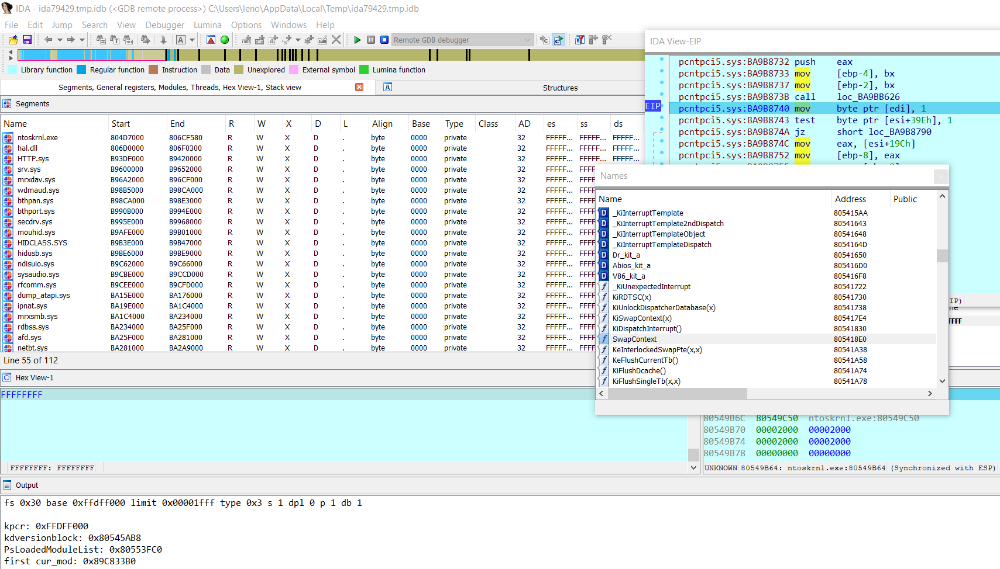

# ida_vmware_windows_gdb.py
Helper script for Windows kernel debugging with IDA Pro on VMware + GDB stub (including PDB symbols)

python3 + idapython 7.4

## Demo video

https://youtu.be/q5MrGKqtmAg

## Related 

Helper script for Windows kernel debugging with IDA Pro on native Bochs debugger

https://github.com/therealdreg/ida_bochs_windows

## Credits

Based on original IDA-VMware-GDB By Oleksiuk Dmytro (aka Cr4sh) https://github.com/Cr4sh/IDA-VMware-GDB
